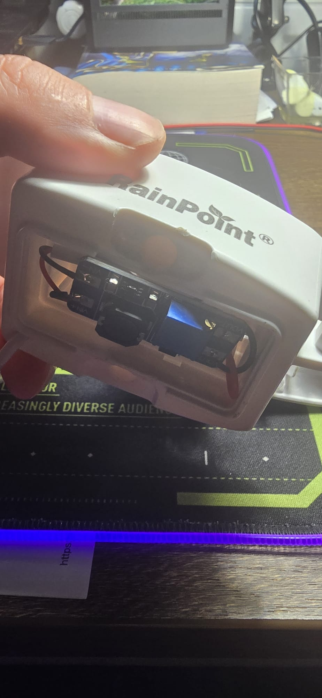
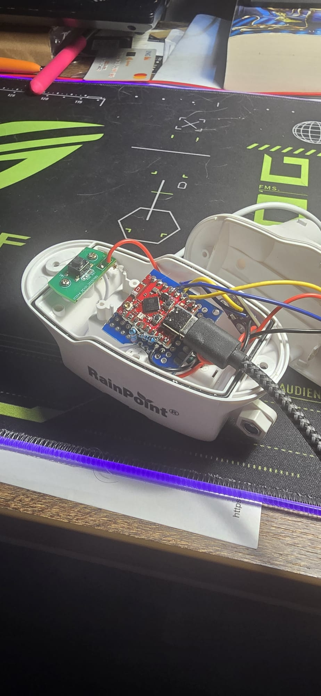
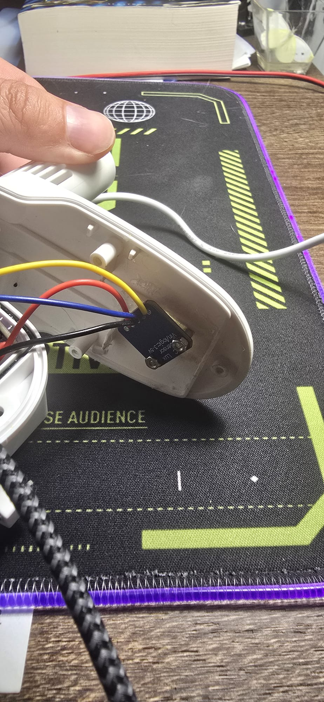
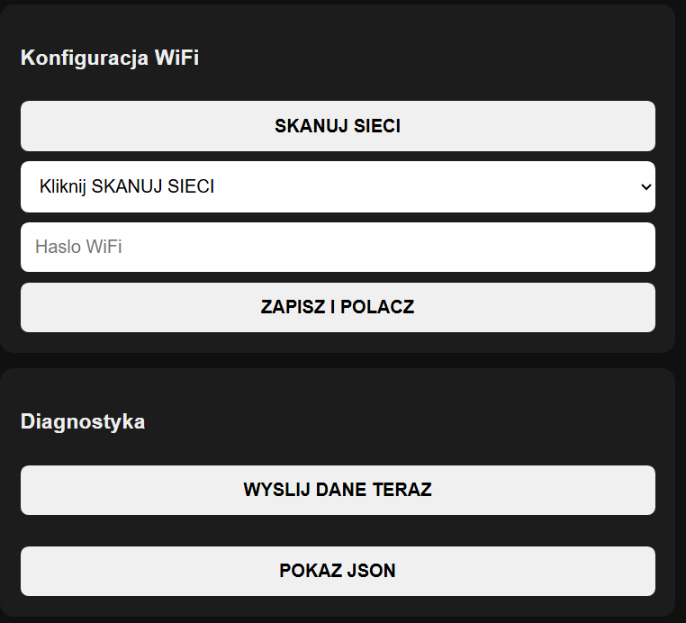

# Galeria prototypu

**[English](gallery.md) | Polski**

Strona dokumentuje aktualny, działający prototyp T-REX Facade Weather Station.
Zawiera wyłącznie bezpieczne publicznie zdjęcia i zrzuty: bez zapisanych haseł
Wi-Fi, prywatnej nazwy sieci oraz adresu sieci lokalnej.

## Obudowa RainPoint i moduł zasilania

Prototyp wykorzystuje obudowę RainPoint. Moduł z serii MT zapewnia stabilne
zasilanie 5 V wewnątrz obudowy.

## Montaż wewnętrzny

Sterownik ESP32-C3 Mini oraz czujnik BME temperatury, wilgotności i ciśnienia
zamontowane w prototypie.

Dedykowany czujnik światła przygotowany dla stacji fasadowej.

## Interfejs WWW

Lokalny panel WWW umożliwia konfigurację Wi-Fi i podstawową diagnostykę.
Zrzut pokazuje pusty formularz, bez zapisanej nazwy sieci lub hasła.

## Uwagi

Zdjęcia przedstawiają aktualny prototyp, a nie produkcyjną płytkę PCB ani
finalną konstrukcję mechaniczną. Rozmieszczenie elementów może się zmieniać
pomiędzy egzemplarzami. Elementami odtwarzalnymi projektu są połączenia
elektryczne, zachowanie firmware oraz logika styku RainPoint opisana w
pozostałej dokumentacji repozytorium.
