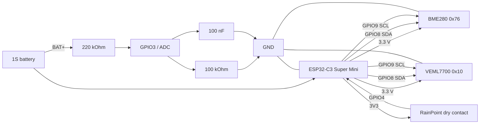

# Hardware and wiring

**English | [Polski](wiring_PL.md)**

## Connection diagram



The diagram is intentionally functional rather than a PCB schematic. It shows the electrical connections needed to reproduce the prototype.

## Prototype mechanical integration

In the current prototype, the RainPoint enclosure is reused as the enclosure for the complete facade station. The original RainPoint mechanical rain detector remains connected as the dry-contact sensor, while the ESP32-C3, BME280, VEML7700, battery-measurement divider and power source are installed inside the same enclosure.

Mechanical placement depends on the exact RainPoint enclosure and the parts used. Protect the electronics from direct water ingress and place the environmental sensors so they can measure the conditions they are intended to sense.

## I2C sensors

| Device | VCC | GND | SDA | SCL | Address |
| --- | --- | --- | --- | --- | --- |
| BME280 | 3.3 V | common GND | GPIO8 | GPIO9 | `0x76` |
| VEML7700 | 3.3 V | common GND | GPIO8 | GPIO9 | `0x10` |

Use 3.3 V logic modules. Most breakouts already include I2C pull-ups; do not add excessive parallel pull-ups.

## RainPoint

```text
ESP32-C3 3V3 ---- RainPoint dry contact ---- GPIO4
```

GPIO4 uses `INPUT_PULLDOWN`. Closed contact reads HIGH and means dry. Open contact reads LOW and means rain.
The RainPoint must not apply an external voltage to GPIO4.

## Battery input

```text
BAT+ ---- 220 kOhm ----+---- GPIO3
                       |
                     100 kOhm
                       |
                      GND

GPIO3 ---- 100 nF ---- GND
```

Connect battery negative to ESP32 GND. The firmware has a prototype ADC calibration table for this divider.

## Pin summary

| Function | GPIO |
| --- | --- |
| SDA | GPIO8 |
| SCL | GPIO9 |
| RainPoint | GPIO4 |
| Battery ADC | GPIO3 |
