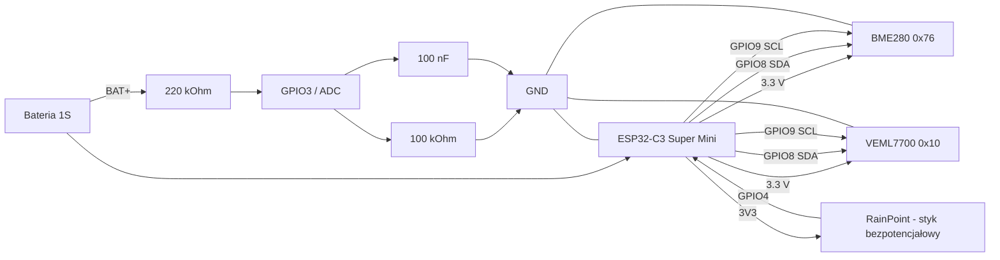

# Hardware i podłączenie

**[English](wiring.md) | Polski**

## Diagram połączeń



Diagram jest celowo schematem funkcjonalnym, a nie projektem PCB. Pokazuje połączenia elektryczne potrzebne do odtworzenia prototypu.

## Integracja mechaniczna prototypu

W aktualnym prototypie obudowa RainPoint jest wykorzystywana jako obudowa całej stacji fasadowej. Oryginalny mechaniczny czujnik deszczu RainPoint pozostaje podłączony jako styk bezpotencjałowy, a wewnątrz tej samej obudowy umieszczone są ESP32-C3, BME280, VEML7700, dzielnik do pomiaru baterii oraz źródło zasilania.

Dokładne rozmieszczenie elementów zależy od wersji obudowy RainPoint i użytych podzespołów. Elektronikę należy chronić przed bezpośrednim dostaniem się wody, a czujniki środowiskowe umieścić tak, aby mogły mierzyć warunki, do których są przeznaczone.

## Czujniki I2C

| Urządzenie | VCC | GND | SDA | SCL | Adres |
| --- | --- | --- | --- | --- | --- |
| BME280 | 3.3 V | wspólna masa | GPIO8 | GPIO9 | `0x76` |
| VEML7700 | 3.3 V | wspólna masa | GPIO8 | GPIO9 | `0x10` |

Używaj modułów pracujących z logiką 3.3 V. Wiele gotowych płytek ma już rezystory podciągające I2C, dlatego nie należy bez potrzeby dodawać kolejnych równoległych pull-upów.

## RainPoint

```text
ESP32-C3 3V3 ---- bezpotencjałowy styk RainPoint ---- GPIO4
```

GPIO4 pracuje jako `INPUT_PULLDOWN`.

- styk zamknięty = HIGH = sucho
- styk otwarty = LOW = deszcz

RainPoint jest traktowany jako suchy styk i nie może podawać zewnętrznego napięcia na GPIO4.

## Pomiar baterii

```text
BAT+ ---- 220 kOhm ----+---- GPIO3
                       |
                     100 kOhm
                       |
                      GND

GPIO3 ---- 100 nF ---- GND
```

Minus baterii połącz ze wspólną masą ESP32. Firmware zawiera tabelę kalibracyjną ADC przygotowaną dla prototypowego dzielnika.

## Podsumowanie pinów

| Funkcja | GPIO |
| --- | --- |
| SDA | GPIO8 |
| SCL | GPIO9 |
| RainPoint | GPIO4 |
| ADC baterii | GPIO3 |
